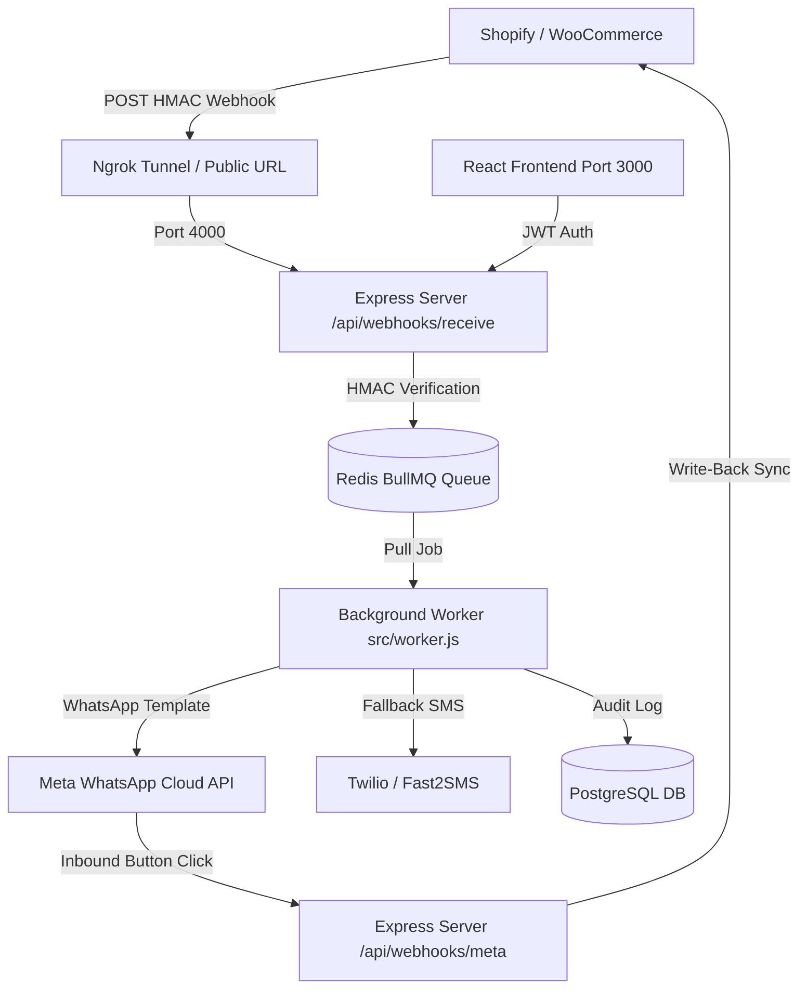

# 🧪 Complete QA & Testing Master Guide
## WhatsApp & SMS Automation SaaS for Shopify & WooCommerce

> **Target Audience**: QA Engineers, Full-Stack Testers, and DevOps Developers  
> **Scope**: End-to-End verification of WhatsApp Cloud API, SMS Gateways (Twilio & Fast2SMS), Shopify & WooCommerce Integrations, Two-Way COD Order Write-Backs, Background BullMQ Workers, and Merchant Frontend UI.

---

## 📋 Table of Contents
1. [Architecture & Local Testing Prerequisites](#1-architecture--local-testing-prerequisites)
2. [Module 1: Meta WhatsApp Cloud API Setup & Testing](#2-module-1-meta-whatsapp-cloud-api-setup--testing)
   - [Where to go & What to create in Meta](#where-to-go--what-to-create-in-meta)
   - [WhatsApp Message Templates Setup](#whatsapp-message-templates-setup)
   - [Live WhatsApp Connectivity Test via CLI](#live-whatsapp-connectivity-test-via-cli)
   - [Meta Inbound Webhook Handshake & Button Callback Test](#meta-inbound-webhook-handshake--button-callback-test)
3. [Module 2: SMS Provider Setup & Fallback Testing](#3-module-2-sms-provider-setup--fallback-testing)
   - [Twilio Configuration & Testing](#twilio-configuration--testing)
   - [Fast2SMS Configuration & Testing](#fast2sms-configuration--testing)
   - [Built-in Mock/Sandbox Mode (Free Testing)](#built-in-mocksandbox-mode-free-testing)
   - [WhatsApp-to-SMS Fallback Test (Error 131026)](#whatsapp-to-sms-fallback-test-error-131026)
4. [Module 3: Shopify Store Connection & Automation Testing](#4-module-3-shopify-store-connection--automation-testing)
   - [Shopify Partners & Dev Store Setup](#shopify-partners--dev-store-setup)
   - [Connecting Shopify Store to the SaaS](#connecting-shopify-store-to-the-saas)
   - [Live Shopify Webhook Setup](#live-shopify-webhook-setup)
   - [Simulated Shopify Webhook Tests (No Store Required)](#simulated-shopify-webhook-tests-no-store-required)
   - [COD Two-Way Tag Sync Test (`COD-Confirmed` / `COD-Cancelled`)](#cod-two-way-tag-sync-test-cod-confirmed--cod-cancelled)
   - [Abandoned Checkout Recovery & Organic Conversion Check](#abandoned-checkout-recovery--organic-conversion-check)
5. [Module 4: WooCommerce Store Connection & Automation Testing](#5-module-4-woocommerce-store-connection--automation-testing)
   - [WooCommerce REST API & Webhook Creation](#woocommerce-rest-api--webhook-creation)
   - [Connecting WooCommerce Store to the SaaS](#connecting-woocommerce-store-to-the-saas)
   - [Live WooCommerce Webhook Test](#live-woocommerce-webhook-test)
   - [Two-Way Status Write-Back (`processing` / `cancelled`)](#two-way-status-write-back-processing--cancelled)
6. [Module 5: Merchant Frontend Dashboard UI Testing](#6-module-5-merchant-frontend-dashboard-ui-testing)
7. [Module 6: Security, Signature Verification & Edge Cases](#7-module-6-security-signature-verification--edge-cases)
8. [Module 7: Automated Test Suites Matrix](#8-module-7-automated-test-suites-matrix)
9. [Troubleshooting & Common Error Codes Reference](#9-troubleshooting--common-error-codes-reference)

---

## 1. Architecture & Local Testing Prerequisites

Before running any functional tests, ensure all core services are running locally.



### ⚡ Step-by-Step Local Startup Checklist

Open **4 separate terminal windows** in the project root:

| Terminal | Command | Purpose | Expected Output |
| :--- | :--- | :--- | :--- |
| **Terminal 1** | `npm run dev` | Express API Server (`http://localhost:4000`) | `[Server] HTTP server listening on port 4000` |
| **Terminal 2** | `npm run worker` | Standalone BullMQ Worker | `[Worker] BullMQ Worker listening on queue: ecommerce-webhooks` |
| **Terminal 3** | `npm run dev:tunnel` | Automated Ngrok Webhook Tunnel | Public `https://*.ngrok-free.app` URL generated |
| **Terminal 4** | `npm run frontend:dev` | Merchant Frontend UI (`http://localhost:3000`) | `Local: http://localhost:3000/` |

> [!NOTE]
> Ensure **PostgreSQL** (`port 5432`) and **Redis** (`port 6379`) are running before starting the servers.
> Quick check:
> ```bash
> redis-cli ping       # Should return PONG
> npm run prisma:migrate # Verify PostgreSQL schema is up-to-date
> ```

---

## 2. Module 1: Meta WhatsApp Cloud API Setup & Testing

### Where to go & What to create in Meta

1. **Visit**: [Meta for Developers Apps Console](https://developers.facebook.com/apps/)
2. **Create/Select App**:
   - Click **Create App** ➜ Select **Other** ➜ Select **Business** ➜ Enter an App Name (e.g., `OmniPulse Ecom SaaS`).
3. **Add WhatsApp Product**:
   - In the App Dashboard, scroll to **WhatsApp** and click **Set Up**.
4. **Get Credentials from API Setup**:
   - In the left sidebar, click **WhatsApp** ➜ **API Setup**.
   - Note the **Phone number ID** (e.g., `104827592817293`).
   - Note the **WhatsApp Business Account ID** (e.g., `103948572619482`).
   - Copy the **Temporary access token** (starts with `EAAG...`) for immediate testing, OR generate a **Permanent System User Token** from [Meta Business Manager](https://business.facebook.com/settings/system-users).

5. **Authorize Your Test Phone Number (Meta Sandbox)**:
   - On the same **API Setup** page, locate the **To** recipient dropdown.
   - Click **Manage phone number list**.
   - Add your physical mobile phone number (with country code, e.g. `+91 98765 43210` or `+1 555 123 4567`).
   - Enter the 6-digit OTP received on WhatsApp to verify your number.

6. **Update `.env` file**:
   ```env
   META_PHONE_NUMBER_ID="your_phone_number_id_here"
   META_ACCESS_TOKEN="your_meta_access_token_here"
   META_BUSINESS_ACCOUNT_ID="your_whatsapp_business_account_id"
   META_WEBHOOK_VERIFY_TOKEN="omnipulse_meta_verify_token_123"
   ```

---

### WhatsApp Message Templates Setup

WhatsApp Cloud API requires pre-approved templates for business-initiated messages.

#### Template 1: `order_confirmation` (Utility Category)
1. Navigate to: [Meta WhatsApp Message Templates Manager](https://business.facebook.com/wa/manage/message-templates/)
2. Click **Create Template**:
   - **Category**: `Utility`
   - **Name**: `order_confirmation`
   - **Language**: `English (US)` (`en_US`)
3. Body text:
   ```text
   Hello {{1}}, thank you for your order! Your order {{2}} for {{3}} has been confirmed and is being prepared for shipment.
   ```
4. Sample Values:
   - `{{1}}`: `Aarav Sharma`
   - `{{2}}`: `#1001`
   - `{{3}}`: `USD 149.99`
5. Click **Submit for Review** (Utility templates approve in 1–5 minutes).

#### Template 2: `cod_interactive_verification` or `hello_world`
- Meta provides a default template named `hello_world` that is pre-approved on all accounts for zero-friction testing.
- For COD verification, our system sends an **Interactive Button Message** directly via Graph API (`/messages` with `type: interactive`), so no prior template approval is required once customer initiates contact, or utility template can be used.

---

### Live WhatsApp Connectivity Test via CLI

Test direct dispatch to your real phone without needing Shopify or WooCommerce:

```bash
# 1. Quick test using Meta's pre-approved 'hello_world' template:
node scripts/test-live-whatsapp.js +919876543210 --template hello_world

# 2. Test using custom 'order_confirmation' template with sample data:
node scripts/test-live-whatsapp.js +919876543210 \
  --template order_confirmation \
  --name "Test Customer" \
  --order "#TEST-99" \
  --total "₹1,499.00"
```

**Expected Result**:
- Terminal displays: `[WhatsAppService] Status Code: 200 OK | Message ID: wamid.HBgL...`
- Your physical mobile phone receives the WhatsApp message instantly.

---

### Meta Inbound Webhook Handshake & Button Callback Test

When a customer taps **[Confirm Order]** or **[Cancel Order]** on WhatsApp, Meta sends a webhook callback to our backend to update the database and store tags.

#### Step 1: Webhook Handshake (GET /api/webhooks/meta)
1. Start the tunnel: `npm run dev:tunnel`.
2. Copy your public callback URL: `https://<YOUR-NGROK-DOMAIN>.ngrok-free.app/api/webhooks/meta`.
3. In [Meta App Dashboard](https://developers.facebook.com/apps/) ➜ **WhatsApp** ➜ **Configuration**:
   - Click **Edit** under **Webhook**.
   - **Callback URL**: `https://<YOUR-NGROK-DOMAIN>.ngrok-free.app/api/webhooks/meta`
   - **Verify Token**: `omnipulse_meta_verify_token_123`
   - Click **Verify and Save**. Meta will execute a `GET` handshake with `hub.challenge`.
   - Under **Webhook Fields**, click **Manage** and subscribe to **`messages`**.

#### Step 2: Simulate Button Click (POST /api/webhooks/meta)
Execute this `curl` command to test inbound button replies:

```bash
curl -X POST http://localhost:4000/api/webhooks/meta \
  -H "Content-Type: application/json" \
  -d '{
    "object": "whatsapp_business_account",
    "entry": [{
      "id": "103948572619482",
      "changes": [{
        "value": {
          "messaging_product": "whatsapp",
          "metadata": { "phone_number_id": "104827592817293" },
          "messages": [{
            "from": "919876543210",
            "id": "wamid.HBgL123456789",
            "timestamp": "1710000000",
            "type": "interactive",
            "interactive": {
              "type": "button_reply",
              "button_reply": {
                "id": "cod_confirm_1024",
                "title": "Confirm Order"
              }
            }
          }]
        },
        "field": "messages"
      }]
    }]
  }'
```

**Expected Result**:
- Backend logs: `[MetaWebhook] ✅ OrderVerification updated to "CONFIRMED" for Order 1024`
- Order status changes to `CONFIRMED` in database.

---

## 3. Module 2: SMS Provider Setup & Fallback Testing

The SaaS supports two SMS Gateways: **Twilio** (Global) and **Fast2SMS** (India DLT).

### Twilio Configuration & Testing
- **Console Link**: [Twilio Console](https://console.twilio.com/)
- **Required Keys**:
  - `accountSid`: Found on Twilio Dashboard (e.g., `ACxxxxxxxxxxxxxxxxxxxxxxxxxxxxxxxx`)
  - `authToken`: Found on Twilio Dashboard
  - `fromNumber`: Twilio Purchased Phone Number (e.g., `+15551234567`) or approved Alphanumeric Sender ID.

### Fast2SMS Configuration & Testing
- **Console Link**: [Fast2SMS Dev Dashboard](https://www.fast2sms.com/dashboard/dev-api)
- **Required Keys**:
  - `apiKey`: Fast2SMS Authorization Key
  - `senderId`: Approved 6-character DLT Header (or leave blank for quick route `q`)

### Built-in Mock/Sandbox Mode (Free Testing)
If you do not have live SMS credits, the system provides automatic mock simulation:
- Using `accountSid` starting with `mock_` or `AC_TEST_ACCOUNT_SID`
- Using `apiKey` starting with `mock_` or `fast2sms_mock_api_key`
The service simulates SMS dispatch, generates a fake Message SID (`SM_...` or `FST_...`), and logs to console without incurring costs.

### WhatsApp-to-SMS Fallback Test (Error 131026)
When a customer's phone number is **not registered on WhatsApp** (Meta error code `131026`), the BullMQ worker automatically triggers SMS fallback.

To test this:
1. Ensure the store has SMS configured with `fallbackToSms: true`.
2. Send a webhook with a mobile number that is intentionally not on WhatsApp.
3. Observe the BullMQ worker log:
   ```text
   [Worker] 🔀 Customer not on WhatsApp (Error 131026). Triggering SMS Fallback via TWILIO...
   [Worker] ✅ SMS Fallback successfully sent to 15551234567 (ID: SM_...) [MessageLog: ...]
   ```
4. Verify in `MessageLog` table: `status` is set to `SMS_FALLBACK` and `channel` is set to `SMS`.

---

## 4. Module 3: Shopify Store Connection & Automation Testing

### Shopify Partners & Dev Store Setup
1. Go to: [Shopify Partners Console](https://partners.shopify.com/)
2. Navigate to **Stores** ➜ **Add store** ➜ **Create development store**.
3. Once created, log into the store admin: `https://admin.shopify.com/store/<YOUR_STORE_NAME>`.
4. Go to **Settings** (bottom-left) ➜ **Apps and sales channels** ➜ **Develop apps**.
5. Click **Create an app** (Name: `WaNotify Automation`).
6. Under **Configuration** ➜ **Admin API integration**, enable the following scopes:
   - `read_orders` & `write_orders`
   - `read_checkouts` & `write_checkouts`
   - `read_customers`
7. Click **Save** and **Install app**.
8. Reveal and copy the **Admin API access token** (`shpat_xxxxxxxxxxxxxxxxxxxxxxxxxxxx`).

---

### Connecting Shopify Store to the SaaS

#### Method A: Via Frontend UI
1. Navigate to `http://localhost:3000/dashboard/stores`.
2. Click **+ Connect New Store**.
3. Select **Shopify**.
4. Enter:
   - **Store URL**: `your-store-name.myshopify.com`
   - **Admin Access Token**: `shpat_...`
   - **Webhook Secret**: Your desired secret (or Shopify shared secret).
5. Click **Connect Store**.

#### Method B: Via API Endpoint
```bash
curl -X POST http://localhost:4000/api/stores/connect \
  -H "Content-Type: application/json" \
  -d '{
    "userId": "YOUR_USER_UUID",
    "platform": "SHOPIFY",
    "storeUrl": "my-fashion-test.myshopify.com",
    "accessToken": "shpat_test_access_token_12345",
    "webhookSecret": "my_shopify_secret_key_123"
  }'
```

---

### Live Shopify Webhook Setup
In your Shopify Admin:
1. Go to **Settings** ➜ **Notifications** ➜ Scroll to **Webhooks** ➜ **Create webhook**.
2. **Event**: `Order creation` (`orders/create`)
3. **Format**: `JSON`
4. **URL**: `https://<YOUR-NGROK-DOMAIN>.ngrok-free.app/api/webhooks/receive`
5. **Webhook API version**: `Latest (2024-01 or newer)`
6. Click **Save**.
7. Note down the **Webhook signing secret** shown at the bottom of the Webhooks page and ensure it matches `webhookSecret` in your store record in the database.

---

### Simulated Shopify Webhook Tests (No Store Required)

The repository includes pre-built simulation scripts that compute valid HMAC-SHA256 signatures and post directly to your server:

```bash
# 1. Simulate Standard Order Creation (Triggers order_confirmation)
npm run simulate:webhook

# 2. Simulate with custom phone number:
node scripts/simulate-webhook.js +919876543210

# 3. Simulate Cash on Delivery (COD) Order (Triggers interactive verification buttons)
npm run simulate:cod

# 4. Simulate Abandoned Checkout (Triggers recovery reminder)
npm run simulate:abandoned
```

**What happens behind the scenes:**
1. Computes `crypto.createHmac('sha256', secret).update(rawPayload).digest('base64')`.
2. Sends HTTP headers: `X-Shopify-Shop-Domain`, `X-Shopify-Topic: orders/create`, `X-Shopify-Hmac-Sha256`.
3. Server verifies signature in timing-safe manner (`crypto.timingSafeEqual`).
4. Queues job to Redis BullMQ.
5. Returns `200 OK` in `< 15ms`.
6. Background worker processes job, renders template, and contacts WhatsApp API.

---

### COD Two-Way Tag Sync Test (`COD-Confirmed` / `COD-Cancelled`)

When a customer clicks **Confirm** on WhatsApp:
1. `POST /api/webhooks/meta` is received.
2. The controller calls `syncOrderToStore(verification, 'CONFIRMED')` in `ecommerceService.js`.
3. The service calls Shopify Admin API:
   `PUT https://<store>.myshopify.com/admin/api/2024-01/orders/<order_id>.json`
4. Payload:
   ```json
   {
     "order": {
       "tags": "COD-Confirmed",
       "note": "[WaNotify] Cash on Delivery verified via WhatsApp at <TIMESTAMP> UTC"
     }
   }
   ```
5. **How to Verify**:
   - Open Shopify Admin ➜ Orders ➜ Open the test order.
   - Look at the right sidebar **Tags**: `COD-Confirmed` will be added.
   - Look at the **Timeline / Notes**: An audit note will be present.

---

### Abandoned Checkout Recovery & Organic Conversion Check

Our worker includes intelligent **Organic Conversion Protection** (`checkRecentOrderForCustomer`):
- If an abandoned checkout webhook fires, but the customer already placed an order in the last 24 hours, the SaaS **skips** sending the recovery message to avoid spamming the customer.
- **Verification**: Run `npm run test:abandoned` which tests:
  - Fresh abandoned cart ➜ recovery message queued.
  - Completed order exists ➜ `RECOVERED_ORGANICALLY` logged, notification safely suppressed.

---

## 5. Module 4: WooCommerce Store Connection & Automation Testing

### WooCommerce REST API & Webhook Creation
1. Log into your WordPress / WooCommerce Admin (`https://yourstore.com/wp-admin`).
2. Go to **WooCommerce** ➜ **Settings** ➜ **Advanced** ➜ **REST API**.
3. Click **Add Key**:
   - **Description**: `WaNotify SaaS Connector`
   - **User**: Select your Admin user
   - **Permissions**: `Read/Write`
4. Click **Generate API Key**. Copy **Consumer Key** (`ck_...`) and **Consumer Secret** (`cs_...`).
5. Combine them as: `ck_...:cs_...` for the access token.

#### Create WooCommerce Webhook
1. Go to **WooCommerce** ➜ **Settings** ➜ **Advanced** ➜ **Webhooks**.
2. Click **Add Webhook**:
   - **Name**: `WaNotify Order Created`
   - **Status**: `Active`
   - **Topic**: `Order created`
   - **Delivery URL**: `https://<YOUR-NGROK-DOMAIN>.ngrok-free.app/api/webhooks/receive`
   - **Secret**: A custom secret string (e.g. `wc_live_webhook_secret_999`)
   - **API Version**: `WP REST API Integration v3`
3. Click **Save Webhook**.

---

### Connecting WooCommerce Store to the SaaS
In the Merchant Dashboard (`/dashboard/stores`) or via API:
```bash
curl -X POST http://localhost:4000/api/stores/connect \
  -H "Content-Type: application/json" \
  -d '{
    "userId": "YOUR_USER_UUID",
    "platform": "WOOCOMMERCE",
    "storeUrl": "https://my-woo-store.com",
    "accessToken": "ck_test12345:cs_test67890",
    "webhookSecret": "wc_live_webhook_secret_999"
  }'
```

---

### Live WooCommerce Webhook Test
You can test WooCommerce webhook reception using `curl` with WooCommerce headers:

```bash
# HMAC generation and curl dispatch:
SECRET="wc_live_webhook_secret_999"
PAYLOAD='{"id":2048,"status":"processing","payment_method":"cod","payment_method_title":"Cash on delivery","total":"250.00","currency":"USD","billing":{"first_name":"John","phone":"+919876543210"}}'
SIG=$(echo -n "$PAYLOAD" | openssl dgst -sha256 -hmac "$SECRET" -binary | base64)

curl -X POST http://localhost:4000/api/webhooks/receive \
  -H "Content-Type: application/json" \
  -H "X-WC-Webhook-Source: https://my-woo-store.com/" \
  -H "X-WC-Webhook-Topic: order.created" \
  -H "X-WC-Webhook-Signature: $SIG" \
  -d "$PAYLOAD"
```

---

### Two-Way Status Write-Back (`processing` / `cancelled`)
When a COD order is verified by a WooCommerce customer:
1. `ecommerceService.updateWooCommerceOrder(store, orderId, 'CONFIRMED')` is executed.
2. Issues `PUT /wp-json/wc/v3/orders/2048` with `{ "status": "processing" }`.
3. Issues `POST /wp-json/wc/v3/orders/2048/notes` with note: `[WaNotify] Cash on Delivery verified via WhatsApp`.
4. If customer clicks **Cancel Order**, status is updated to `"cancelled"`.

---

## 6. Module 5: Merchant Frontend Dashboard UI Testing

Open `http://localhost:3000` in your browser.

| Route | Page | Test Cases to Execute |
| :--- | :--- | :--- |
| `/register` | Merchant Registration | 1. Enter new email and password.<br>2. Verify validation rules (password length, email format).<br>3. Submit and verify redirection to Onboarding/Dashboard. |
| `/login` | Merchant Login | 1. Login with valid credentials ➜ verify JWT is saved to `localStorage`.<br>2. Try invalid password ➜ verify clear error banner. |
| `/dashboard` | Overview Analytics | 1. Verify KPI Cards: Total Messages, Delivery Rate, Failed Messages, Connected Stores.<br>2. Copy Webhook URL button works.<br>3. Pipeline architecture visual displays properly. |
| `/dashboard/stores` | Connected Stores | 1. View list of connected stores.<br>2. Click **Connect New Store** ➜ test modal form validation.<br>3. Verify token and secrets are redacted (`***`). |
| `/dashboard/automations` | Notification Rules | 1. Toggle `ORDER_CREATED`, `COD_VERIFICATION`, `ABANDONED_CHECKOUT`, `ORDER_FULFILLED`.<br>2. Toggle **Fallback to SMS** switch.<br>3. Save and refresh page ➜ verify persistent settings in PostgreSQL. |
| `/dashboard/logs` | Message Audit Logs | 1. Verify columns: Customer Phone, Status (`SENT`, `FAILED`, `PENDING`, `SMS_FALLBACK`), Channel, Timestamp.<br>2. Test Status Filter dropdown (`ALL`, `SENT`, `FAILED`, `PENDING`).<br>3. Click log item to inspect full Metadata JSON modal. |
| `/dashboard/settings` | Settings & API Keys | 1. Configure Meta WhatsApp Cloud API credentials (`Phone Number ID`, `Access Token`, `WABA ID`).<br>2. Configure SMS Gateway (Twilio vs Fast2SMS credentials).<br>3. Save and verify successful notification toast. |
| `/dashboard/billing` | Stripe Subscriptions | 1. View Free, Basic, and Pro pricing cards.<br>2. Click Upgrade ➜ verify redirect to Stripe Checkout session. |

---

## 7. Module 6: Security, Signature Verification & Edge Cases

### Security Test 1: Tampered Webhook HMAC Signature (Expected: 401 Unauthorized)
Send an order webhook with an altered payload or invalid signature:

```bash
curl -X POST http://localhost:4000/api/webhooks/receive \
  -H "Content-Type: application/json" \
  -H "X-Shopify-Shop-Domain: test-brand.myshopify.com" \
  -H "X-Shopify-Topic: orders/create" \
  -H "X-Shopify-Hmac-Sha256: INVALID_TAMPERED_BASE64_SIGNATURE==" \
  -d '{"id":999999,"total_price":"999.00"}'
```

**Expected Response**:
- HTTP `401 Unauthorized`
- Body: `{"success":false,"error":"Unauthorized","message":"Invalid webhook signature"}`

### Security Test 2: Unregistered Store Domain (Expected: 404 Not Found)
```bash
curl -X POST http://localhost:4000/api/webhooks/receive \
  -H "Content-Type: application/json" \
  -H "X-Shopify-Shop-Domain: hacker-unregistered-store.com" \
  -H "X-Shopify-Topic: orders/create" \
  -H "X-Shopify-Hmac-Sha256: fake==" \
  -d '{"id":1}'
```

**Expected Response**:
- HTTP `404 Not Found` with message: `Store not registered in OmniPulse SaaS`.

### Edge Case 3: Missing or Landline Phone Number
- Payload with no phone number: Gracefully logged as `FAILED` in `MessageLog` with reason `INVALID_OR_MISSING_PHONE`. The server and worker do **not** crash.

---

## 8. Module 7: Automated Test Suites Matrix

The codebase includes **12 pre-built automated test suites**. You can run them all at once or individually:

```bash
# Run ALL test suites sequentially:
npm test
```

### Individual Test Suites Breakdown

| Command | Suite Name | What It Tests |
| :--- | :--- | :--- |
| `npm run test:webhook` | Webhook Security | HMAC-SHA256 signature verification, replay protection, Shopify & Woo headers. |
| `npm run test:worker` | Background Worker | BullMQ job consumption, payload mapping, template assembly, phone normalization. |
| `npm run test:cod` | COD Verification Flow | Interactive button generation, inbound webhook parsing, DB state transitions. |
| `npm run test:ecommerce` | E-commerce Store Sync | Two-way write-back to Shopify (tags/notes) and WooCommerce (status/notes). |
| `npm run test:automations` | Automation Rules | Trigger event rule toggles, variable interpolation, enabled/disabled states. |
| `npm run test:abandoned` | Abandoned Checkout | Cart recovery message construction and organic purchase avoidance. |
| `npm run test:sms` | SMS & Fallback | Twilio & Fast2SMS dispatchers, WhatsApp markdown stripping, error 131026 fallback. |
| `npm run test:dashboard` | Dashboard Analytics | Aggregations, delivery rates, pagination, store listing. |
| `npm run test:settings` | Settings Management | Credential updates, encryption/redaction, store-level overrides. |
| `npm run test:billing` | Stripe Billing | Plan updates, subscription status handling, webhook checkout callbacks. |
| `npm run test:shopify` | Shopify OAuth Flow | OAuth handshake, HMAC verification, access token exchange. |
| `npm run test:onboarding` | Merchant Onboarding | Multi-step onboarding state machine and initial rule creation. |

---

## 9. Troubleshooting & Common Error Codes Reference

### Meta WhatsApp Cloud API Errors

| Error Code | Error Message / Cause | How to Fix |
| :--- | :--- | :--- |
| **190** | `Invalid OAuth access token` or `Access token has expired` | Generate a new token in [Meta API Setup](https://developers.facebook.com/apps/) or create a permanent System User Token. |
| **131026** | `Message undeliverable` (User not on WhatsApp) | Expected when testing non-WhatsApp numbers. Ensure **Fallback to SMS** is enabled to verify SMS fallback. |
| **131042** | `Business eligibility or payment issue` | Add a payment method to your WhatsApp Business Account in Meta Business Manager. |
| **131047** | `Re-engagement message` (24h window closed) | You must use a pre-approved template message (`type: template`), not freeform text. |
| **100** | `Invalid parameter` / `Template does not exist` | Ensure template name matches exactly in Meta Templates Manager (case-sensitive) and language code is set correctly (e.g. `en_US`). |
| **429 / 130429** | `Rate limit hit` | BullMQ worker handles rate limits with exponential backoff. Increase tier in Meta Business Manager if on live volume. |

### System & Connection Issues

| Symptom | Cause | Solution |
| :--- | :--- | :--- |
| `ECONNREFUSED 127.0.0.1:6379` | Redis server not running | Start Redis via `redis-server` or `brew services start redis`. |
| `Invalid Webhook Signature` (401) | Webhook secret mismatch | Verify `webhookSecret` in DB matches the secret in Shopify/WooCommerce. |
| Ngrok shows `ERR_NGROK_3200` | Tunnel expired or offline | Run `npm run dev:tunnel` again and update the webhook URL in Meta / Shopify. |
| Worker not processing jobs | Worker process not running | Run `npm run worker` in a dedicated terminal window. |

---

*Generated for OmniPulse WhatsApp & SMS Automation SaaS. For internal QA, testing, and developer verification.*
